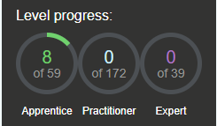
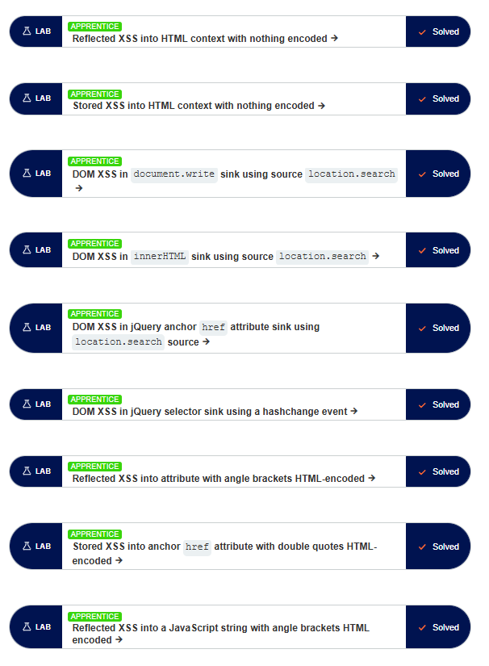
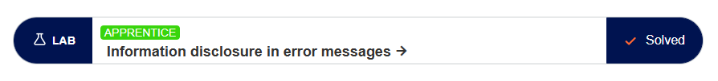

# Cybersecurity Assignment

**Student Name:** Fahim Orko
**Course:** Cyber Security and Data Privacy  
**Assignment Type:** Individual Assignment  
**Language:** English

---

## 1. PortSwigger

### Completed Labs

📸

> 

Below is the list of PortSwigger Web Security Academy labs completed during this course:

- **SQL Injection**

  - SQL injection vulnerability in WHERE clause allowing retrieval of hidden data
  - SQL injection vulnerability allowing login bypass
     

- **Access Control Vulnerabilities**

  - Unprotected admin functionality
  - Unprotected admin functionality with unpredictable URL
  - User role controlled by request parameter
     

- **Authentication Vulnerabilities**

  - Username enumeration via different responses
  - 2FA simple bypass
  - Password reset broken logic
     

- **Cross-Site Scripting (XSS)**

  - Reflected XSS into HTML context with nothing encoded
  - Stored XSS into HTML context with nothing encoded
  - DOM XSS in `document.write` sink using `location.search` as source
  - DOM XSS in `innerHTML` sink using `location.search` as source
  - DOM XSS in jQuery anchor `href` attribute sink using `location.search` source
  - DOM XSS in jQuery selector sink using a `hashchange` event
  - Reflected XSS into attribute with angle brackets HTML-encoded
  - Stored XSS into anchor `href` attribute with double quotes HTML-encoded
  - Reflected XSS into a JavaScript string with angle brackets HTML-encoded
     

- **Information disclosure**

  - Information disclosure in error messages

---

#### Lab - SQL Injection

> 

---

#### Lab - Authentication

> 

---

#### Lab - Access Token

> 

---

#### Lab - Cross Site Scripting

> 

---

#### Lab - Information disclosure

---

## 2. The Booking System Project

This section describes the work carried out during each phase of the Booking System security assessment project.

---

### The Booking system project → Phase 1 → Part 1

**Description:**

> In this phase, I set up the penetration testing environment for the Booking System Phase 1 application and performed comprehensive functionality and security testing on the registration page. The testing included automated scanning using OWASP ZAP and manual browser-based testing to identify input validation, authentication, and configuration vulnerabilities.

**What worked:**

> The application was successfully deployed in the local environment and accessible through the browser. OWASP ZAP scanning worked as expected and identified multiple security misconfigurations, including missing CSRF protection, weak security headers, and application error disclosure.

**What didn’t work:**

> OWASP ZAP’s automated spider scan did not detect certain high-risk vulnerabilities, such as SQL Injection and Path Traversal. These issues required manual testing through the browser to identify, highlighting limitations of automated tools when used alone.

**What took the most time:**

> The most time-consuming task was manually testing input fields with different payloads and analyzing server responses to confirm SQL Injection behavior and path traversal patterns that were not flagged automatically.

**What I learned:**

> I learned how to combine automated vulnerability scanning with manual penetration testing to achieve more reliable results. This phase reinforced the importance of understanding backend behavior, input validation weaknesses, and the limitations of automated security tools in real-world testing scenarios.

---

### The Booking system project → Phase 1 → Part 2

**Description:**

> In this phase, I tested the updated version of the Booking System application provided in Part 2. I repeated penetration and functionality testing on the registration feature, ran a second OWASP ZAP scan, and verified whether the previously reported Top 5 findings from Part 1 had been fixed. I documented the results in a new ZAP report and prepared a structured discussion post reporting findings and fixes to the development team.

**What worked:**

> Several issues reported in Part 1 were successfully fixed. User enumeration via registration was resolved, email format validation was correctly enforced, inconsistent long password behavior was fixed, and the previously identified SQL Injection vulnerability was mitigated. Input sanitization and validation were noticeably improved in the updated application.

**What didn’t work:**

> Some critical security controls were still missing. Weak passwords are still accepted without enforcing complexity rules, future birthdates are not validated, and CSRF protection is still absent from the registration form. These issues remained unchanged despite the updated version of the application.

**What took the most time:**

> The most time-consuming part was verifying each previous finding individually, repeating manual tests, comparing behaviors between Part 1 and Part 2, and confirming results using both browser-based testing and ZAP scans.

**What I learned:**

> I learned how to systematically verify fixes instead of just identifying vulnerabilities. The phase reinforced the importance of combining automated tools with manual testing, documenting clear verification steps, and understanding how security fixes should be validated in

---

### The Booking system project → Phase 2

**Description:**

> In this phase, I tested the Phase 2 version of the Booking System application, ran an additional OWASP ZAP scan, and produced a third ZAP report. I also completed a password-cracking exercise based on the system’s password-handling implementation explained in the course video. Using multiple techniques and tools, I cracked at least five user passwords and documented the methods, evidence, and security implications.

**What worked:**

> Password cracking was successful using a combination of online hash lookup tools, Hashcat dictionary attacks, and rule-based attacks. Common and predictable passwords were recovered quickly, especially those present in public wordlists. ZAP scanning and manual verification worked as expected for identifying remaining security weaknesses in the application.

**What didn’t work:**

> Simple dictionary attacks alone were not sufficient for all users. Some passwords required rule-based enhancements to generate realistic variations before they could be cracked. This demonstrated the limitation of relying only on basic wordlists without transformation rules.

**What took the most time:**

> The most time-consuming task was configuring and running Hashcat attacks, testing different approaches, and documenting each cracked password with clear explanations and screenshots. Applying and tuning rule-based attacks required additional trial and verification.

**What I learned:**

> I learned the practical differences between dictionary, rule-based, and non-dictionary attacks, and how attackers benefit from offline access to password hashes. The exercise clearly demonstrated why longer and more complex passwords significantly improve security, and why strong hashing, salting, and additional controls such as MFA are critical to protecting user credentials.

---

### The Booking system project → Phase 3

**Description:**

> In this phase, I performed role-based authorization testing on the Phase 3 version of the Booking System. I tested the system using three roles—Guest, Reserver, and Administrator—and verified what each role can and cannot do by comparing the actual behavior of pages and API endpoints against the official specifications. Testing included manual browser interaction, direct URL and API access, OWASP ZAP scanning, and endpoint discovery using Gobuster. All findings were consolidated into a structured authorization test report.

**What worked:**

> Frontend access controls generally behaved as expected: guests were blocked from protected pages, reservers could not access admin interfaces, and basic role separation existed at the UI level. Reservation creation worked correctly for authenticated reservers, and sensitive information such as plaintext passwords was not exposed, aligning partially with GDPR and Privacy by Design expectations.

**What didn’t work:**

> Backend authorization was not consistently enforced. Multiple sensitive API endpoints (`/api/users`, `/api/reservations`, `/api/resources`) were accessible without authentication, leading to serious data disclosure issues. Administrator functionality was also incomplete, with missing admin endpoints and an inaccessible admin dashboard. These gaps indicate a mismatch between the specifications and the actual implementation.

**What took the most time:**

> The most time-consuming part was systematically enumerating all pages and API endpoints, testing each one across all three roles, and validating whether access control decisions were enforced at the backend rather than just the frontend.

**What I learned:**

> I learned how critical backend authorization checks are, regardless of frontend restrictions. The phase highlighted the risks of exposed APIs, user enumeration, and ID-based data access, and reinforced how role-based access control must be enforced consistently to meet security, GDPR, and Privacy by Design requirements.

---

### The Booking system project → Phase 4

**Description:**

> In this phase, I evaluated the Booking System strictly from a GDPR and Privacy by Design perspective. I completed a structured GDPR compliance checklist by mapping personal data flows, reviewing registration and booking behavior, and assessing how personal data is stored, exposed, and controlled. I also reviewed the visibility of privacy-related documentation and user rights handling based on the actual system behavior.

**What worked:**

> The system follows several core GDPR principles correctly. Data minimization is largely respected, only necessary personal data is collected, and public booking views do not expose personal identities. Role-based access control limits who can view or manage personal data, passwords are securely hashed, and pseudonymization is used in reservations. Overall, Privacy by Default is reasonably well implemented.

**What didn’t work:**

> The application itself lacked proper GDPR documentation by default. Privacy, terms, and cookie policy pages were either empty or missing, requiring full manual creation. This highlights that GDPR requirements were not implemented at the application level and had to be addressed externally through documentation.

**What took the most time:**

> The most time-consuming part was drafting accurate and appropriate policy content that matched the application’s actual functionality, data collection, and user roles while remaining compliant with GDPR requirements.

**What I learned:**

> I learned how GDPR compliance goes beyond technical security and requires clear documentation, transparency, and user rights handling. The phase reinforced the importance of Privacy by Design and how missing or vague policies can be a compliance risk even if the application’s core functionality works correctly.

---

### Final Reflection (50–100 words)

This project provided a practical understanding of cybersecurity beyond theory. By combining automated tools like OWASP ZAP with manual testing, I learned how real vulnerabilities such as SQL injection, weak authentication, and broken authorization are identified and verified in practice. The later phases highlighted that security also includes GDPR compliance, transparency, and proper documentation, not just technical fixes. As a future full-stack developer, this experience reinforced the responsibility to build secure systems by design, enforce backend controls, and consider privacy and data protection from the earliest development stages.

---

## 3. Logbook

### Git Repository

🔗 **GitHub Repository Link:**

> [Repository Link](https://github.com/FahimOrko/Log-Book)

---

### Time Spent on the Course

**Total Hours Spent:**

> 89 hours

---

### Hours Per Topic

| Topic                           | Hours |
| ------------------------------- | ----- |
| Cisco Cybersecurity Course      | 12    |
| SQL Injection (Lab)             | 3     |
| Authentication (Lab)            | 3     |
| Access Control / Tokens (Lab)   | 3     |
| Cross-site scripting (Lab)      | 7     |
| Information disclosure (Lab)    | 2     |
| Booking System – Phase 1 Part 1 | 11    |
| Booking System – Phase 1 Part 2 | 12    |
| Booking System – Phase 2        | 11    |
| Booking System – Phase 3        | 10    |
| Booking System – Phase 4        | 4     |
| Watching Class Recordings       | 8     |
| Final Report & Finishin Up      | 3     |

> _(Data based on course logbook)_

> **Logbook Link:** [Log-Book Repository](https://github.com/FahimOrko/Log-Book/blob/main/README.md)

---

## 4. Feedback

> This course introduced me to a new area of technology within cybersecurity and significantly expanded my technical understanding. I learned how to identify and handle common vulnerabilities such as SQL injection and authentication flaws, which aligns well with my focus on full-stack development. The course improved my awareness of how to secure web applications and APIs during development. It also increased my interest in cybersecurity as a field, and my next goal is to further explore ethical hacking and defensive security practices.

---

## ⚠️ Caution & Ethical Notice

All activities documented in this assignment were performed strictly within authorized educational environments provided by the course.

No testing, exploitation, or attack techniques were used on real-world systems without permission.

This work complies with ethical guidelines and Finnish cybersecurity legislation.
