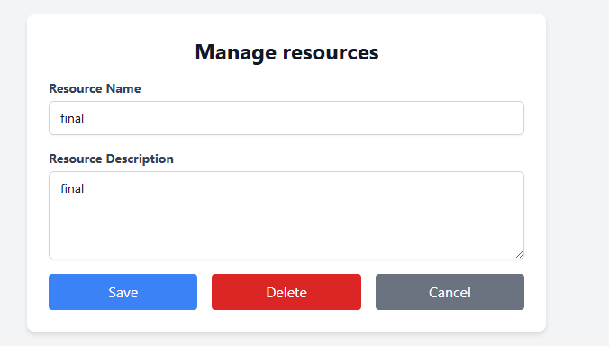
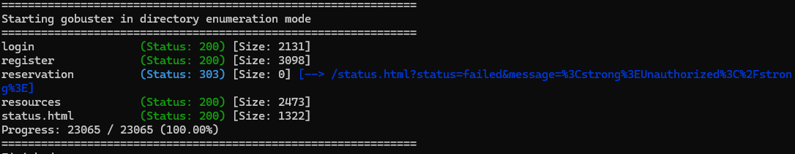
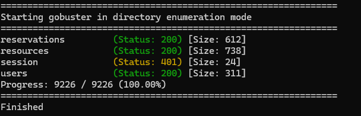

# Authorization Testing Report

## Application Information

- **Target Application:** Resource Reservation System
- **Base URL:** http://localhost:8003
- **Testing Type:** Role-based authorization verification
- **Roles Tested:** Guest, Reserver, Administrator

### Tools Used

- Web browser (manual testing)
- OWASP ZAP
- Gobuster (endpoint discovery)
- Manual URL and API endpoint testing

---

## 🧑‍🦲 Guest (Not Logged In)

### ✅ Can Do

- **View public resource list**

  - Endpoint: `/`
  - Observation: Resources and booking time slots are visible without authentication.
  - Spec match: ✅ Yes (Specification 8)

- **View booked time slots without identity disclosure**

  - Endpoint: `/`
  - Observation: Booked resources are displayed without showing reserver identity.
  - Spec match: ✅ Yes (Specification 8, GDPR compliant)

- **Access login page**

  - Endpoint: `/login`
  - Observation: Login form is accessible.
  - Spec match: ✅ Yes

- **Access registration page**

  - Endpoint: `/register`
  - Observation: Registration form is accessible.
  - Spec match: ✅ Yes

- **Access resources page**
  - Endpoint: `/resources`
  - Observation: Resources are visible without login.
  - Spec match: ⚠️ Not explicitly restricted in specs

---

### ❌ Cannot Do (Expected but Violated)

- **Access reservations API**

  - Endpoint: `GET /api/reservations`
  - Observation: Returns full reservation data including IDs, resource names, and booking times.
  - Spec match: ❌ No
  - Impact: Unauthorized disclosure of reservation data.

- **Access users API**

  - Endpoint: `GET /api/users`
  - Observation: Returns full user list including usernames, roles, and user tokens.
  - Spec match: ❌ No
  - Impact: Critical user enumeration and role disclosure.

- **Access resources API**

  - Endpoint: `GET /api/resources`
  - Observation: Full resource list accessible without authentication.
  - Spec match: ❌ No
  - Impact: Backend authorization not enforced.

- **Access reservation creation page**

  - Endpoint: `/reservation`
  - Observation: Redirected to unauthorized status page.
  - Spec match: ✅ Yes

- **Create reservations**

  - Endpoint: `POST /api/reservations`
  - Observation: Request rejected without authentication.
  - Spec match: ✅ Yes

- **Access user profile**

  - Endpoint: `/profile`
  - Observation: Redirected to login.
  - Spec match: ✅ Yes

- **Access admin pages**
  - Endpoint: `/admin/*`
  - Observation: Access denied or redirected.
  - Spec match: ✅ Yes

---

## 🧑‍💼 Reserver (Authenticated User)

### ✅ Can Do

- **Log in**

  - Endpoint: `/login`
  - Observation: Authentication successful.
  - Spec match: ✅ Yes

- **View resource list**

  - Endpoint: `/resources`
  - Observation: Resources visible.
  - Spec match: ✅ Yes

- **Create reservations**
  - Endpoints: `/reservation`, `POST /api/reservations`
  - Observation: Reservations can be created successfully.
  - Spec match: ✅ Yes

---

### ❌ Cannot Do / Authorization Issues

- **View own profile**

  - Endpoint: `/profile`
  - Observation: Own user data is not displayed.
  - Spec match: ❌ No (functionality missing)

- **Access admin dashboard**

  - Endpoint: `/admin`
  - Observation: Access denied.
  - Spec match: ✅ Yes

- **Manage resources**

  - Endpoint: `/admin/resources`
  - Observation: Access denied.
  - Spec match: ✅ Yes (Specification 4)

- **Delete users**

  - Endpoint: `/api/admin/users/:id`
  - Observation: Returns error response.
  - Spec match: ✅ Yes (Specification 5)

- **View or modify other users’ reservations**
  - Endpoint: `/api/reservations/:id`
  - Observation: Reservation data is returned, but modification is not possible.
  - Spec match: ⚠️ Partial — ID-based access control is weak due to data disclosure.

---

## 🧑‍💼🛡️ Administrator

### ✅ Can Do

- **Manage resources**

  - Endpoint: `/resources?id={id}`
  - Observation: Resources can be created, modified, and deleted.
  - 
  - Spec match: ✅ Yes (Specification 4)

- **View all reservations**
  - Endpoint: `GET /api/reservations`
  - Observation: All reservations are visible.
  - Spec match: ✅ Yes

---

### ❌ Cannot Do / Missing Functionality

- **Access admin dashboard**

  - Endpoint: `/admin`
  - Observation: Admin dashboard not accessible even when logged in.
  - Spec match: ❌ No

- **Delete reserver accounts**

  - Endpoint: `/admin/users/delete/:id`
  - Observation: Endpoint not found.
  - Spec match: ❌ No (Specification 5)

- **View sensitive credentials**
  - Observation: No plaintext passwords or sensitive credentials exposed.
  - Spec match: ✅ Yes (GDPR, Privacy by Design)

---

## 🔍 Phase 3 – Endpoint Discovery Results

### Gobuster Directory Enumeration (`/`)

Discovered endpoints:

- `/login`
- `/register`
- `/reservation`
- `/resources`
- `/status.html`

- 

### Gobuster API Enumeration (`/api`)

Discovered endpoints:

- `/api/reservations`
- `/api/resources`
- `/api/users`
- `/api/session`

- 

---

## 🚨 Critical Authorization Findings

1. **Missing backend authorization**

   - Sensitive API endpoints are accessible without authentication.
   - Affects `/api/reservations`, `/api/users`, and `/api/resources`.

2. **User enumeration and role disclosure**

   - `/api/users` exposes usernames, roles, and user tokens.
   - Violates GDPR and Privacy by Design principles.

3. **Reservation data disclosure**
   - Guests can access full reservation data via API.
   - Violates principle of least privilege.

---

## 📌 Conclusion

The application does not correctly enforce authorization at the backend.  
While frontend access controls exist, sensitive API endpoints are exposed to unauthenticated users, leading to critical authorization failures.

The system does **not** fully comply with the provided specifications, GDPR requirements, or Privacy by Design principles.
