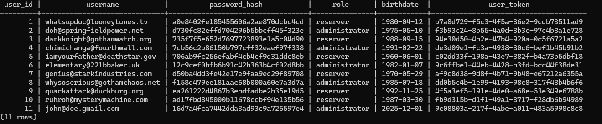
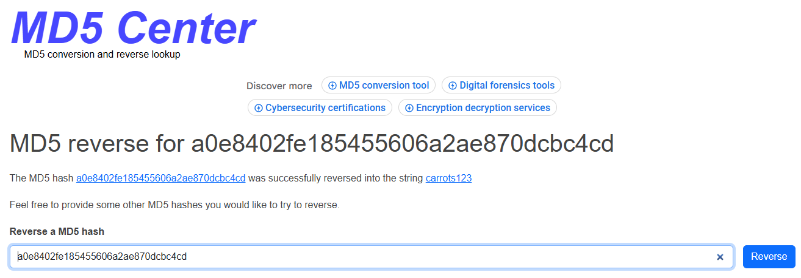
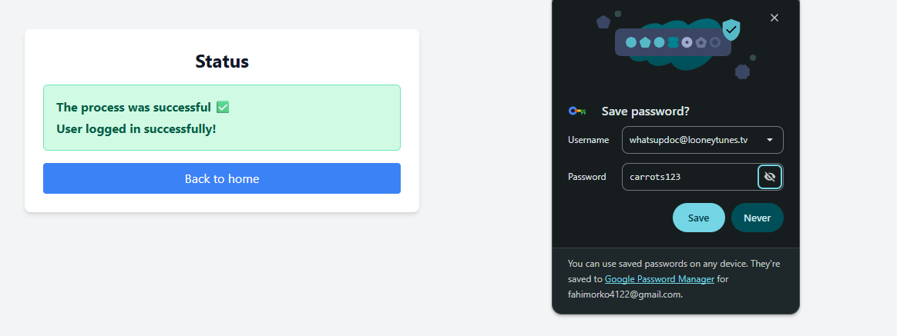
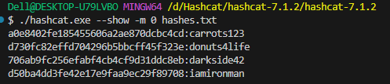
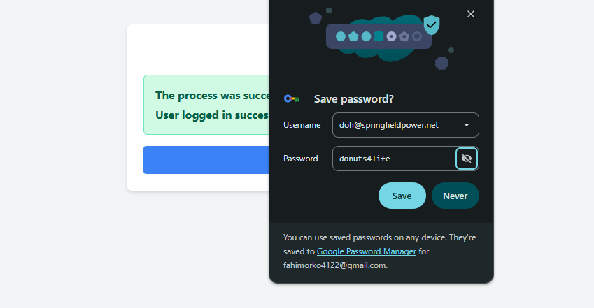
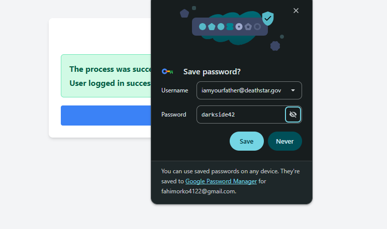
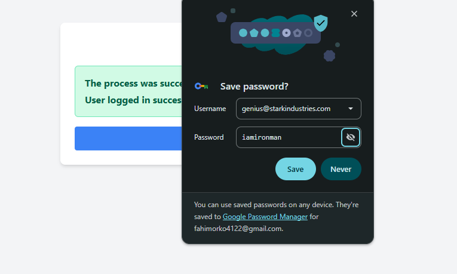
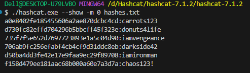
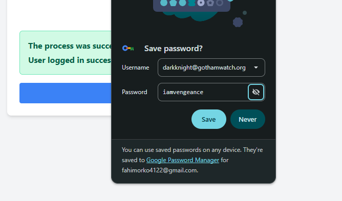

# Phase 2 Password Cracking Report – Booking System

## Overview

As part of the Booking System project (Phase 2), we conducted password-cracking exercises for selected users. The process followed the guidelines from the course, including both dictionary-based and rule-based attacks. Screenshots and methods used are included below.

---

### List of users

---

## Cracked Passwords

### User 1

- Username: whatsupdoc@looneytunes.tv

- Password: carrots123

- Method: Online MD5 reverse hash tool

- Explanation: The MD5 hash was found in a public hash database, allowing immediate recovery.

- Screenshots:

---

### Users 2, 3, & 4

- User 2: doh@springfieldpower.net
  → donuts4life

- User 3: iamyourfather@deathstar.gov
  → darkside42

- User 4: genius@starkindustries.com
  → iamironman

- Method: Hashcat dictionary attack using rockyou.txt

- Command Used: `./hashcat.exe -m 0 -a 0 hashes.txt rockyou.txt`

---

### User 5

- Username: darkknight@gothamwatch.org

- Password: iamvengeance

- Method: Hashcat dictionary attack with rule-based enhancement

- Command Used: `./hashcat.exe -m 0 -a 0 hashes.txt rockyou.txt -r rules/dive.rule`

- Explanation: The password was not present in the standard wordlist alone. Applying the dive.rule allowed Hashcat to generate variants, which successfully matched the hash.

- Screenshots:

---

## Methodology

- Dictionary Attack: Compared hashes to known wordlists (rockyou.txt). Efficient for common passwords.

- Rule-Based Attack: Applied transformation rules to expand the dictionary, covering patterns like capitalization, numeric suffixes, and symbol replacements.

- Online MD5 Lookup: Immediate recovery for simple, widely used passwords.

---

## Discussion Questions

### Dictionary vs Non-Dictionary Attacks:

- Dictionary attacks use predefined wordlists and variants.

- Non-dictionary (brute-force) attacks try all possible character combinations without relying on wordlists.

### Advantages of Database Access for Attackers:

- Access to password hashes allows offline attacks at high speed.

- Attackers can test passwords without triggering login security mechanisms, increasing efficiency and stealth.

### Benefits of Longer Passwords:

- Longer passwords increase the number of possible combinations exponentially.

- They reduce the effectiveness of brute-force and dictionary attacks, making password cracking significantly harder.

---

## Conclusion

All assigned passwords were successfully recovered using a combination of online tools, Hashcat dictionary attacks, and rule-based enhancements. The exercise demonstrates the importance of strong password policies, multi-factor authentication, and proper hashing mechanisms to protect stored credentials.

---

## Caution / Ethical Notice

The password‑cracking activities performed in this assignment were conducted exclusively for academic testing purposes within the controlled environment provided by the course. No techniques used here were applied outside the scope of the Booking System project. The intent was not to perform unauthorized access, attacks, or malicious operations, but to evaluate system weaknesses and demonstrate the need for stronger password practices. All findings are reported responsibly and ethically.

All assigned passwords were successfully recovered using a combination of online tools, Hashcat dictionary attacks, and rule‑based enhancements. The exercise demonstrates the importance of strong password policies, multi‑factor authentication, and proper hashing mechanisms to protect stored credentials.
