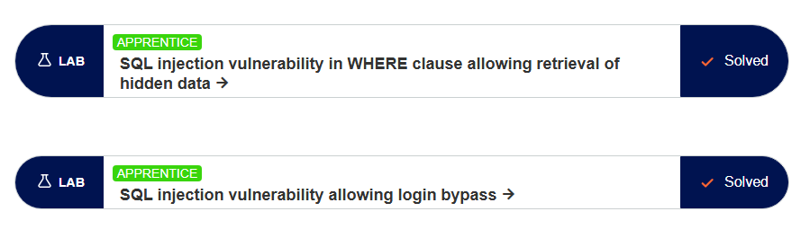
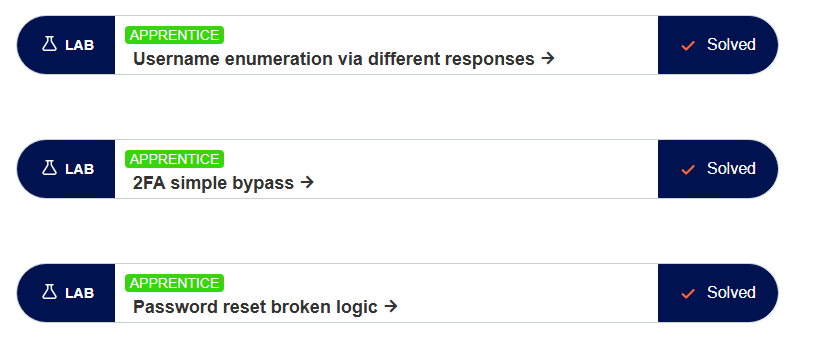

# Log-Book

Cyber Security Course

---

### Time Table

| Date       | Used hours |      Subject(s)      |                     output                      |
| :--------- | :--------: | :------------------: | :---------------------------------------------: |
| 11.07.2025 |     3      |  First Assingnmnet   |      Completing Cybersecurity course CISCO      |
| 11.08.2025 |     3      |  First Assingnmnet   |      Completing Cybersecurity course CISCO      |
| 11.09.2025 |     3      |  First Assingnmnet   |      Completing Cybersecurity course CISCO      |
| 11.16.2025 |     3      |  Second Assingnmnet  |                  SQL Injection                  |
| 11.17.2025 |     3      |  Second Assingnmnet  |                 Authentication                  |
| 11.18.2025 |     3      |  Second Assingnmnet  |                  Access Token                   |
| 11.27.2025 |     3      | Booking Phase Part 1 |   Penatration Testing Reports - Reading Docs    |
| 11.28.2025 |     4      | Booking Phase Part 1 |   Penatration Testing Reports - Reading Docs    |
| 12.01.2025 |     6      | Booking Phase Part 2 |   Penatration Testing Reports - Reading Docs    |
| 12.02.2025 |     6      | Booking Phase Part 2 |   Penatration Testing Reports - Reading Docs    |
| 12.07.2025 |     3      | Booking Phase Part 3 | Cracking Password - Learing diffrent Techniques |
| 12.08.2025 |     4      | Booking Phase Part 3 | Cracking Password - Learing diffrent Techniques |
| 12.09.2025 |     4      | Booking Phase Part 3 | Cracking Password - Learing diffrent Techniques |
| 17.08.2025 |     2      |   Booking Phase 3    |        Auth Testing - Testing Endpoints         |
| 18.08.2025 |     4      |   Booking Phase 3    |        Auth Testing - Testing Endpoints         |
| 19.08.2025 |     4      |   Booking Phase 3    |        Auth Testing - Testing Endpoints         |
| 12.09.2025 |     3      |   Booking Phase 4    |                 GDPR guidelines                 |

---

#### Lab - SQL Injection

#### Lab - Authentication

#### Lab - Access Token

---

## ⚠️ Caution & Ethical Notice

This logbook documents coursework conducted for the Cybersecurity and Data Privacy module.
All penetration tests, SQL injection exercises, authentication assessments, access‑token analysis, and password‑cracking activities recorded here were performed exclusively within the official course environment and only on systems explicitly designated for testing.

No techniques, tools, or methods shown in this repository have been used — or will ever be used — against any system without proper authorization.
This work is strictly academic, controlled, and compliant with the course’s ethical guidelines and Finnish cybersecurity legislation.

Unauthorized penetration testing, password cracking, or exploitation is illegal and unethical.
Everything demonstrated here serves purely educational and professional‑development purposes within the safe boundaries defined by the course.
