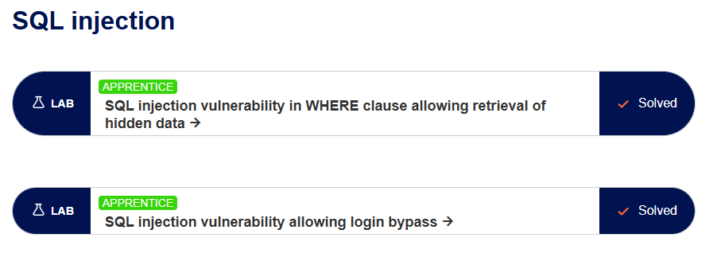
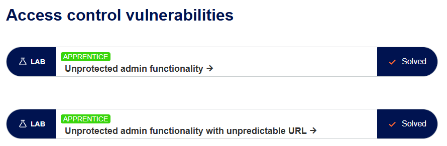
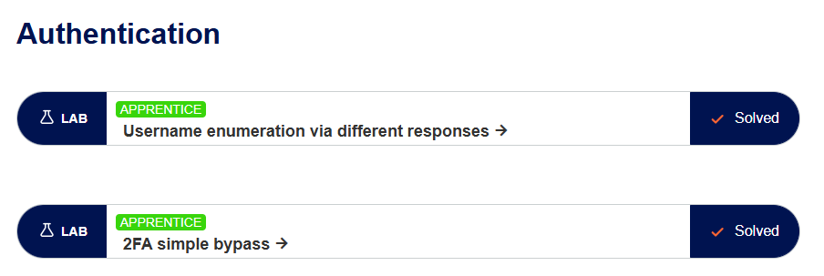

# Log-Book

Cyber Security Course

---

| Date       | Used hours |         Subject(s)         |                            output                            |
| :--------- | :--------: | :------------------------: | :----------------------------------------------------------: |
| 25.01.2024 |     1      |     First Assingnmnet      |         Create a git repo with logbook hour tracking         |
| 09.01.2024 |     2      | Studying About ProtSwigger |       Getting used to the neviroment, snooping around        |
| 09.01.2024 |     5      |     Second Assingnmnet     | SQL Injection Labs, Authentication Labs, Access Contorl Labs |

---

Lab Completed -

